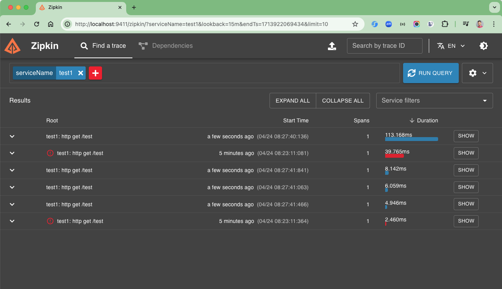
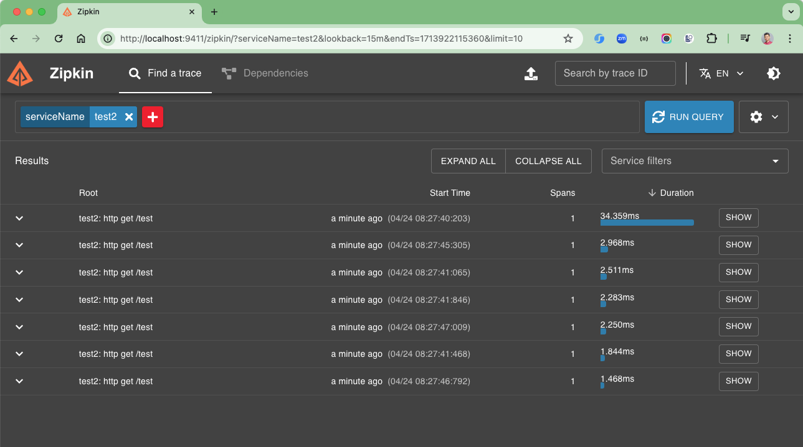
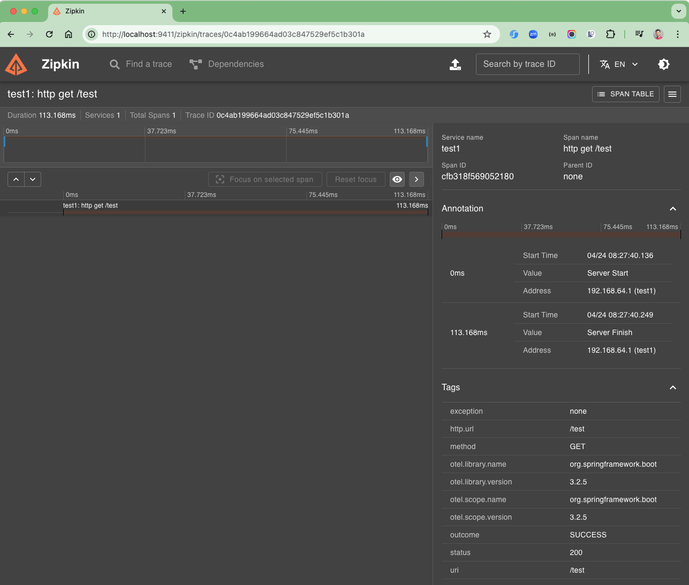

# spring-boot-zipkin-example
Spring Boot Zipkin Example

### Key Terminologies:

1. Trace: It can be used to represent the whole journey as it propagates through a distributed system and contains
   multiple spans.
2. Trace ID: Every trace contains one unique ID that can be named Trace ID, and it can be used to identify the traces
   uniquely in the Zipkin tracing service.
3. Span: It can represent a single unit of work within a trace, and it contains information that includes the operation
   of the request, timing information, metadata, and also the initial request and downstream calls.
4. Span ID: It can be used to uniquely identify the spans within a trace service, and all spans within the same trace
   share the same trace ID.
5. Parent Span ID: It can represent the initial span of the traces, and it can establish the hierarchy of spans in the
   Zipkin trace service.
6. Trace Context: It can contain the data of the Trace ID, Span ID, and parent Span ID that were propagated along with
   the request as a traversal through the different services.
7. Sampler: It is responsible for deciding which requests should be traced and which are not, and it helps to control a
   subset of requests.
8. Reporter: It can generate reports of the sending of span data to the tracing backend, and it can store and analyze
   the traces.
9. Zipkin UI Dashboard: It can represent the UI dashboard interface of the Zipkin server, and it can visualize traces,
   analyze performance, and identify issues with the systems.

### Standing Up Zipkin

Before instrumenting your code and collecting traces, you must first stand up an instance of Zipkin to which you can
send those collections. You have several options, all documented in
the [Zipkin Quickstart](https://zipkin.io/pages/quickstart.html), with the easiest being to run it on Docker. If you
have Docker running locally already, you can get Zipkin running with one command:

```shell
docker run -d -p 9411:9411 openzipkin/zipkin
```

If you don’t have Docker locally but you do have Java installed, it’s almost as easy to run it on your machine. You can
download a pre-built JAR and run it with the following commands:

```shell
curl -sSL https://zipkin.io/quickstart.sh | bash -s
java -jar zipkin.jar
```

Whichever way you choose to run Zipkin, you’ll find it accessible on your machine at http://127.0.0.1:9411. If you open
your browser to this address and see Zipkin running, you’re good to go!

### Things todo list

1. Clone this repository: `git clone https://github.com/hendisantika/spring-boot-zipkin-example.git`
2. Navigate to the folder: `cd spring-boot-zipkin-example`
3. Run the Zipkin Server: `java -jar zipkin.jar`
4. Run the application: `mvn clean spring-boot:run`
5. Open your favorite browser: http://localhost:9411
6. Open your favorite browser: http://localhost:8080/test
7. Open your favorite browser: http://localhost:8081/test

### image Screenshots

Zipkin 1



Zipkin 2



Zipkin 3


